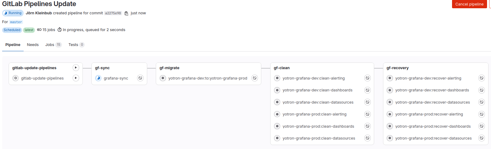
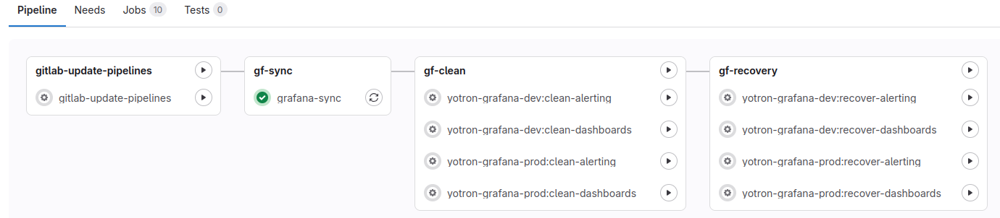
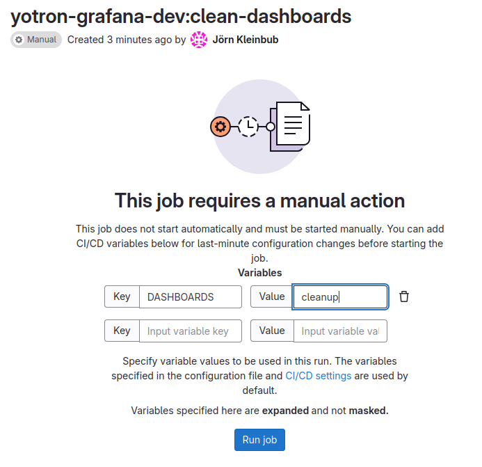
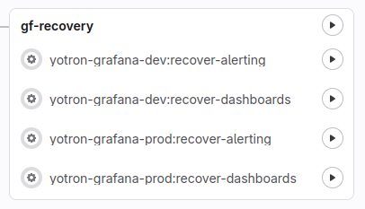

[](https://www.yotron.de)

[YOTRON](https://www.yotron.de) is a consultancy company which is focused on DevOps, Cloud and Kubernetes. Visit us on [www.yotron.de](https://www.yotron.de).

# Grafana Content Manager
The Grafana Content Manager is a service to manage the content of Grafana.

Grafana Content Manager allows
- scheduling of a frequent backup of all objects in their native JSON format and push the content to your Git
- recovering of the backup content to Grafana in case of a loss of Grafana
- cleanup Grafana with all content

You can handle the content of separated Grafana instances in parallel.

With this project you are able to backup and recover
- Dashboards with the GIT-folder `/dashboards/<grafana environment>/`: The default `General` folder of Grafana will be ignored.
- Unified Alerting to folder `alerting/<grafana environment>/`
    - Alert rules
    - Contact Points
    - Mute timings
    - Notification policies
    - Templates

Objects which are currently not part of this tool:
- Data sources
- Users and access
- Settings
- Plugins
...

## Prerequisits
- Grafana: You need access to Grafana with administration rights.
- GitLab: A `.gitlab-ci.yml` to run the process as a Gitlab-CI/CD. So you must commit this project into your own GitLab.
- Grafana ServiceAccount with the `Admin` Role and ApiKey token
- Gitlab Access Token
 
## General settings 

### Dashboards and folder
All dashboards must be located in a folder independently of the `general` folder. This allows a development of dashboards without a sync to Git. 

### setting.yml
In the `setting.yml` file you can add every of your Grafana instance you want to manage. In a base setup you need:

```
git:
  branch: master # The name of the GitBranch you want to store the dashboards, alert rules ... 
grafana: # Minimum one Grafana Instance you want to sync the Dashboards and Alert Rules from
  - name: yotron-grafana-dev # Free name of the Grafana-Instance. 
    apiUrl: https://grafana.apps.k8s.local # API of your Grafana Instance
    apiKeyEnvVariable: GRAFANA_DEV_APIKEY # Environment variable which contains your Grafana-ApiKey-Token
  - name: yotron-grafana-prod
...
```

### Needed environment variables
`GRAFANA_DEV_APIKEY` (e.g.): A free to chose name for an environment variable which contains the ApiKey for a Grafana-Instance.
If you have more than one Grafana Instance you need a environment variable with an api key token for every of your Grafana instances. 

`REQUESTS_CA_BUNDLE`: The trusted CA-Bundle for all requests (e.g. against GitLab or Grafana)

`GIT_TOKEN`: Git-Token to use for commits to the repository.

## General principles
There is one **sync process** for every of your Grafana instances.

The **cleaning and recovery process** are separated between Dashboards and Unified Alerting and between the different Grafana instances.




### General preparing Grafana for recovery
For a recovery Grafana must be available and empty. "Empty" means:

For the recovery of Dashboards:
- no dashboards are available

For the recovery of Unified Alerting:
- no Alert rules

### The cleanup of a Grafana instance
You are able to cleanup Grafana. Cleanup means:
- removing of all Grafana dashboards (despite the one in the `general` and `root` folder of Grafana) 
- Removing all resources of the Unified Alerting like
  - Alert rules
  - Contact Points
  - Mute timings
  - Notification policies
  - Templates
- removing of all folder not in use

## Processing with a GitLab-CICD-Pipeline

### setting.yml
Here the `setting.yml` file with additional settings for Gitlab.

```
  gitlab:
    schedule: # schedule setting for the sync process
      cron: "*/5 * * * *" # Cronjob setting in the Crontab syntax for the backup frequency 
      cron_timezone: Europe/Berlin # Time zone name for the cron setting
      active: true # Git Scheduler is active or not
...
```

### Preparing the pipelines and the scheduler
After committing to a GitLab, in `Build -> Pipelines` a pipeline with the name `gitlab-update-pipelines` is available. 
When started manually all other `Pipelines` and `Pipeline schedules` are created or updated. 



The process must be restarted after every change and commit of the `setting.yml` file to GitLab. 

### Backup
The backup process runs frequently based on the GitLab Scheduler for every of your Grafana environments. 

### The cleanup pipelines
The pipelines to clean up the resources of Grafana are separated by the instances of Grafana and between the `dashboards` and `Unified Alerting` 
resources of Grafana.

You must run the pipeline manually as a Pipeline job.

To prevent accidental starting of this pipeline you must also add an CI/CD variable to the GitLab job. These CI/CD-variables are:

- To clean up `dashboards`
  
  Key: DASHBOARDS  
  
  Value: cleanup

- To clean up `Unified Alerting`

  Key: ALERTING

  Value: cleanup

Here an example to start the cleanup up of the `Unified Alerting` of Grafana.



And then `Run Job`

### How to run a Recovery

1. Check if Grafana is empty or cleaned up

   You can run a Recovery only on an empty Grafana. May you must run the cleanup pipeline (please see above).

1. In case of a desaster recovery prepare Grafana
   
   Please be aware, that the recovery process does not recreate all processes of Grafana. Resources like data sources, plugins aso. must 
   be prepared independently before running the recovery process.

1. Select the pipeline of the GIT commit you want to recover from
 
   The update process is running frequently and syncs all dashboards to this Git-Project.

1. Start the Recovery Job(s) for `dashboards` or `Unified Alerting` of your selected commit
   
   We would recommend to start the recovery process one after the other to prevent race conditions.
   
   You can start the recovery by a GitLab Pipeline Job of this Project. There are Jobs for different recovery topic:

   

    Simply start one or more recovery by starting the job(s) manually.
 
1. Thats's it

   With the next sync job run the recovered dashboards or unifed alerting is synced back to Gitlab.