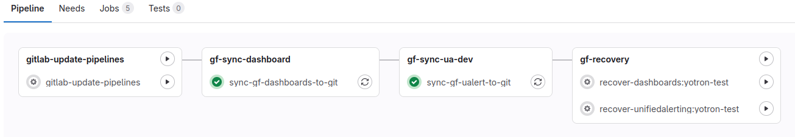
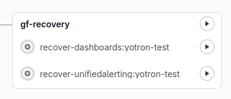

[](https://www.yotron.de)

[YOTRON](https://www.yotron.de) is a consultancy company which is focused on DevOps, Cloud and Kubernetes. Visit us on [www.yotron.de](https://www.yotron.de).

# Grafana Content Manager
The Grafana Content Manager is a service to store and to restore the content of Grafana. 
It does all object in their native JSON format and push the content to a Git.
From there the content is also restorable to Grafana in case of a loss of the content. 

With this project you are able to manage
- Dashboards to folder `/dashboards/<grafana environment>/`: The default `General` folder of Grafana will be ignored.
- Unified Alerting to folder `alerting/<grafana environment>/`
    - Alert rules
    - Contact Points
    - Mute timings
    - Notification policies
    - Templates

You can handle the content of separated Grafana instances in parallel.

## Prerequisits
- GitLab: A `.gitlab-ci.yml` to run the process as a Gitlab-CI/CD. So you must commit this project into your own GitLab.

## General settings and principles

### setting.yml
In the `setting.yml` file you can add every of your Grafana instance you want to manage. In a base setup you need:

```
gitlab:
  branch: master # The name of the GitBranch you want to store the dashboards, ... 
grafanaInstances: # Minimum one Grafana Instance you want to sync the Dashboards and Alert Rules from
  - name: yotron-test # Free name of the Grafana-Instance. 
    apiUrl: https://grafana.apps.k8s.local  # API of your Grafana Instance
    apiKeyEnvVariable: GRAFANA_APIKEY  # Environment variable which contains your Grafana-ApiKey-Token
    ...
```

### General backup principles
The backup follows these principles:
- It does scrape only newly created or updated Grafana dashboards with a different
  version number.
- The process is scraping all dashboards in all folder except the default `General` folder of Grafana.

### General recovery principles
The project contains a recovery process for Dashboards and Unified Alertings .

The recovery can be done separately for every dashboard and Unified Alert Components.

### General preparing Grafana for recovery
For a recovery Grafana must be available and empty. "Empty" means:

For the recovery of Dashboards:
- no dashboards are available

For the recovery of Unified Alerting:
- no Alert rules
- no Contact Points except the default "grafana-default-email"
- no Mute Timings
- no Notification Policies
- no Templates

To clean up Grafana, you can use the ordinary functionality of Grafana.

## Processing with GitLab

### Needed Environment Variables
`GRAFANA_APIKEY`: A free to chose name for an environment variable which contains the ApiKey for the Grafana-Instance.

`JOB_GITLAB_TOKEN`: GitLab-Token to use for commits to the repository.

`REQUESTS_CA_BUNDLE`: The trusted CA-Bundle for all requests (e.g. against GitLab or Python)

### setting.yml
Here the `setting.yml` file with additional settings for Git.

```
gitlab:
  branch: master # The name of the GitBranch you want to store the dashboards, ... 
grafanaInstances: # Minimum one Grafana Instance you want to sync the Dashboards and Alert Rules from
  - name: yotron-test # Free name of the Grafana-Instance. 
    apiUrl: https://grafana.apps.k8s.local  # API of your Grafana Instance
    apiKeyEnvVariable: GRAFANA_APIKEY  # Environment variable which contains your Grafana-ApiKey-Token
    gitlabSyncSchedule: # Setting für den Git Scheduler
      ref: master # The branch name to use in Git
      cron: "*/5 * * * *"  # Cronjob setting in the Crontab syntax for teh backup frequency 
      cron_timezone: Europe/Berlin # Time zone name for the cron setting
      active: true # Git Scheduler is active or not
      variables: # addtional variabels to be added to the GitLab-Scheduler
        test2: test2
  ...
```

### Preparing the pipelines and the scheduler
After committing to a GitLab, in `Build -> Pipelines` a pipeline with the name `gitlab-update-pipelines` is available. 
When started manually all other `Pipelines` and `Pipeline schedules` are created or updated. 



The process must be restarted after every change of the `setting.yml` file. 

### Backup
The backup process runs frequently based on the GitLab Scheduler for every of your Grafana environments. 

### How to run a Recovery
1. Check if Grafana is set up properly

1. Check if Grafana is empty

   You can run a Recovery only on a empty Grafana. If Grafana was prepared from the scratch, it is expected that you can start with an empty Grafana. 
   But check the "emptiness" of Grafana  (please see `Preparation`above)
 
1. Select the right GIT commit to recover
 
   The update process is running frequently and syncs all dashboards to this Git-Project. In a desaster case it could be, that all dashboards vanished. The snyc job would delete the dashboard in Git. 
   In Git simply go back to the commit with the data to recover.  
1. Start the Recovery Job(s) of your selected commit

   You can start the recovery by a GitLab Pipeline Job of this Project. There are Jobs for different recovery topic:

   

    Simply start one or more recovery by starting the job(s) manually.
1. Thats's it

   With the next sync job run the recovered dashboards or unifed alerting is synced back to Gitlab.