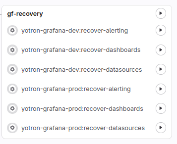

[](https://www.yotron.de)

[YOTRON](https://www.yotron.de) is a consultancy company which is focused on DevOps, Cloud and Kubernetes. Visit us on [www.yotron.de](https://www.yotron.de).

# Grafana Content Manager
The Grafana Content Manager is a service to manage the content of Grafana.

Grafana Content Manager allows
- scheduling of a frequent backup of all objects in their native JSON format and push the content to your Git
- Migrating of dashboard from one Grafana instance to another (from dev to prod for example)
- recovering of the backup content to Grafana in case of a loss of Grafana
- connect to new Grafana data sources in case of an recovery of dashboards or Unified Alerts 
- cleanup Grafana with all content

You can handle the content of separated Grafana instances in parallel.

With this project you are able to backup and recover
- Dashboards: The default `General` folder of Grafana will be ignored.
- Data sources without secrets like passwords
- Unified Alerting
    - Alert rules
    - Contact Points
    - Mute timings
    - Notification policies
    - Templates

Objects which are currently not part of this tool:
- Users and access
- Settings
- Plugins
...

## Prerequisits
- Grafana: You need access to Grafana with administration rights.
- GitLab: A `.gitlab-ci.yml` to run the process as a Gitlab-CI/CD. So you must commit this project into your own GitLab.
- Grafana ServiceAccount(s) with the `Admin` Role and ApiKey token
- Gitlab Access Token
 
## General settings 

### Dashboards and folder
All dashboards must be located in a folder independently of the `general` folder and the `root` folder.
These folder can be used to develop own dashboards without syncing to Git.

### setting.yml
In the `setting.yml` file you can add every of your Grafana instance you want to manage. In a base setup you need:

```
git:
  branch: master # The name of the GitBranch you want to store the dashboards, alert rules ... 
grafana: # Minimum one Grafana Instance you want to sync the Dashboards and Alert Rules from
  - name: yotron-grafana-dev # Free name of the Grafana-Instance. 
    apiUrl: https://grafana-dev.apps.k8s.local # API of your Grafana Instance
    apiKeyEnvVariable: GRAFANA_DEV_APIKEY # Environment variable which contains your Grafana-ApiKey-Token
    allowRecoveryTo: # List of Grafana instances that can dashboards be migarted to
      - yotron-grafana-prod
  - name: yotron-grafana-prod
    apiUrl: https://grafana.apps.k8s.local # API of your Grafana Instance
...
```

### Needed environment variables
`GRAFANA_DEV_APIKEY` (e.g.): A free to chose name for an environment variable which contains the ApiKey for a Grafana-Instance.
If you have more than one Grafana Instance you need a environment variable with an api key token for every of your Grafana instances. 

`REQUESTS_CA_BUNDLE`: The trusted CA-Bundle for all requests (e.g. against GitLab or Grafana)

`GIT_TOKEN`: Git-Token to use for commits to the repository.

## General principles
There is one automatic **sync process** for every of your Grafana instances.

The **migration process** depend on you setting.

The **cleaning and recovery process** are separated between data sources, dashboards and Unified Alerting and between the different Grafana instances.


### Cleanup: Cleanup of a Grafana instance
You are able to clean up Grafana. Clean up means:
- removing of all Grafana dashboards (despite the one in the `general` and `root` folder of Grafana)
- removing all data sources
- removing all resources of the Unified Alerting like
    - Alert rules
    - Contact Points
    - Mute timings
    - Notification policies
    - Templates
- removing of all folder not in use

### Recovery: General preparing of Grafana
For a recovery Grafana must be available and empty. "Empty" means:

For the recovery of Data sources:
- no data sources are available

For the recovery of Dashboards:
- no dashboards are available

For the recovery of Unified Alerting:
- no Alert rules

### Migration: Migration of dashboards to another Grafana
You can define from which Grafana to which Grafana you want to migrate dachboards.

The process of a migration contains the step
- removing of all Grafana dashboards in the targeting Grafana
- recreating all dashboards from the backup of the source Grafana with switching the data sources to the targeting Grafana

To allow a migration of dashboards all data sources of the source Grafana must have a corresponding data source 
with equal name in the targeting Grafana.

## Processing with a GitLab-CICD-Pipeline

### setting.yml
Here the `setting.yml` file with additional settings for Gitlab.

```
  gitlab:
    schedule: # schedule setting for the sync process
      active: true # Git Scheduler is active or not
      cron: "*/5 * * * *" # Cronjob setting in the Crontab syntax for the backup frequency 
      cron_timezone: Europe/Berlin # Time zone name for the cron setting
...
```

### Preparing the pipelines and the scheduler
After committing to a GitLab, in `Build -> Pipelines` a pipeline with the name `gitlab-update-pipelines` is available. 
When started manually all other `Pipelines` and `Pipeline schedules` are created or updated. 


The process must be restarted after every change and commit of the `setting.yml` file to GitLab. 

### How to run a backup
The backup process runs frequently based on the GitLab Scheduler for every of your Grafana environments. 


### How to run a migration of dashboards
Depending on your `allowRecoveryTo` entries in the settings file you find one or more Pipeline with the job name like
`yotron-grafana-dev:to:yotron-grafana-prod` which reflects the source and the target Grafana for the migration.


As a requirement the target Grafana must contain all `data sources` of the source Grafana with equal name.  

1. Select the Pipeline Job the needed source to target connection
   
   All Job has the name `<source Grafana>:to:<target Grafana>`. Select the one you need.

1. Add `UPDATE` and the job name as a `Key` -> `Value` pair 
   
   To prevent a unintentional start of the migration job you must add a `Key` - `Value` pair to start the job.

   Key: `UPDATE`

   Value: job name like `yotron-grafana-dev:to:yotron-grafana-prod`

1. Start the migration job with `Run job`


### How to run a  cleanup
The pipelines to clean up the resources of Grafana are separated by the instances of Grafana and between the `dashboards` and `Unified Alerting` 
resources of Grafana.

You must run the pipeline manually as a Pipeline job.

To prevent accidental starting of this pipeline you must also add an CI/CD variable to the GitLab job. These CI/CD-variables are:
- To clean up `data sources`

  Key: `DATASOURCES`

  Value: `cleanup`

- To clean up `dashboards`
  
  Key: `DASHBOARDS`  
  
  Value: `cleanup`

- To clean up `Unified Alerting`

  Key: `ALERTING`

  Value: `cleanup`

Here an example to start the cleanup up of the `Unified Alerting` of Grafana.


And then `Run Job`

### How to run a recovery

1. Check if Grafana is empty or cleaned up

   You can run a Recovery only on an empty Grafana. May you must run the cleanup pipeline (please see above).

1. Plan you recovery

   `Dashboard` and `Alert rules` needs `data sources` for a proper recovery. 
    
    If `data sources` shall also be recovered, you should start with that. 
    Please be aware, that we do not recover secrets like passwords of `data sources`. You must add them manually add them recreating of the `data sources`.

1. In case of a desaster recovery prepare Grafana
   
   Please be aware, that the recovery process does not recreate all processes of Grafana. Resources like plugins must 
   be prepared independently before running the recovery process.   

1. Select the pipeline of the GIT commit you want to recover from
 
   The update process is running frequently and syncs all dashboards to this Git-Project.

1. Start the Recovery Job(s) for `data sources`, `dashboards` or `Unified Alerting` of your selected commit
   
   We would recommend to start the recovery process one after the other to prevent race conditions.
  
   You can start the recovery by a GitLab Pipeline Job of this Project. There are Jobs for different recovery topic:

   

    Simply start one or more recovery by starting the job(s) manually.
 
1. Thats's it

   With the next sync job run the recovered dashboards or unifed alerting is synced back to Gitlab.